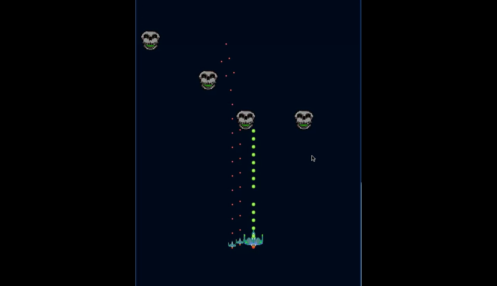

# ShmuPy

A game engine written in Python designed to simply the design of Shmup (Shoot 'em Up) and Shooter games.

## Components
	The Engine is divided to two module systems, graphics and scene. The graphics system contains all the modules used to draw animated sprites to a window as well as provide callbacks for key and mouse input. The scene system manages loading all of the nodes from JSON files into sprites that will be drawn by the graphics system.
	
### Nodes

Every animated sprite is defined as being a node in the scene. These nodes have multiple editable properties that can be defined in a JSON text file with the extension .node.
